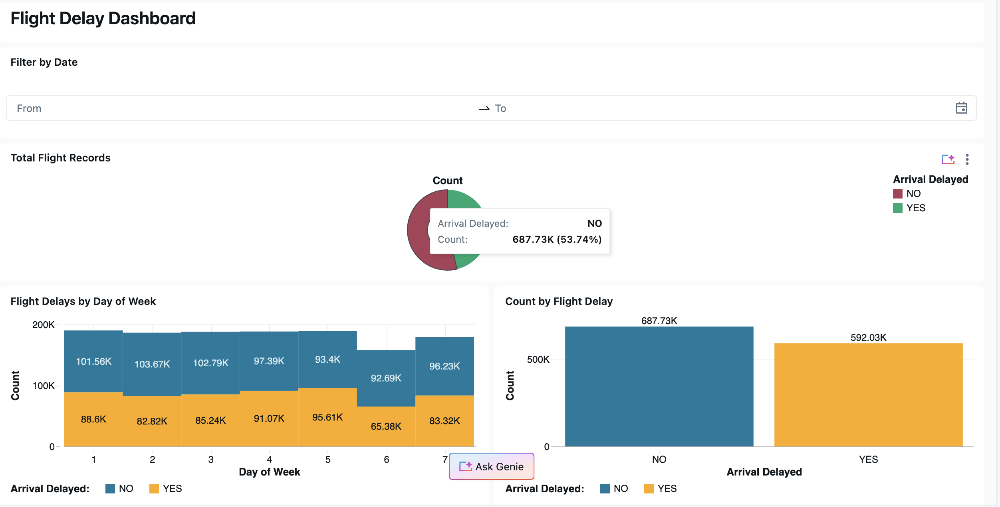
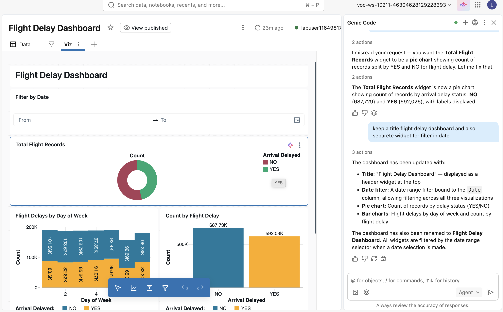

# Databricks SQL: End-to-End Airline Data Analytics Platform

## 🎯 Project Overview

Built a **production-grade data lakehouse** on Databricks implementing the **Medallion Architecture** (Bronze → Silver → Gold) for airline operations analytics. This project demonstrates expertise in **cloud data engineering**, **real-time data processing**, and **AI-powered analytics**.

### Key Highlights
- ✅ Ingested **400K+ flight records** using streaming tables
- ✅ Implemented **3-layer medallion architecture** with data quality checks
- ✅ Built **AI/BI dashboards** with natural language querying (Genie)
- ✅ Applied **AI classification** using Databricks AI Functions
- ✅ Orchestrated **end-to-end workflows** with Lakeflow Jobs
- ✅ Established **data governance** with Unity Catalog (PK/FK constraints)

---

## 🏗️ Architecture

### Medallion Lakehouse Architecture
```
┌─────────────┐     ┌─────────────┐     ┌─────────────┐
│   BRONZE    │────▶│   SILVER    │────▶│    GOLD     │
│  Raw Data   │     │  Cleansed   │     │ Aggregated  │
│  Streaming  │     │   + PK/FK   │     │  Business   │
└─────────────┘     └─────────────┘     └─────────────┘
      ▲                    ▲                    ▲
      │                    │                    │
   CSV Files      Materialized Views     AI/BI Dashboards
```

### Tech Stack
- **Platform:** Databricks Lakehouse (Unity Catalog)
- **Compute:** Serverless SQL Warehouses
- **Storage:** Delta Lake with streaming tables
- **Orchestration:** Lakeflow Jobs
- **Analytics:** Databricks SQL Editor, AI/BI Genie
- **Governance:** Unity Catalog (row-level, column-level permissions)

---

## 📊 Datasets

**Source:** Airline operations data (2007-2024)
- **Flights:** 400K+ records (origin, destination, delays, carriers)
- **Airports:** 300+ US airports (city, state, IATA codes)
- **Lookup Codes:** Airline carrier mappings

---

## 🚀 Implementation Steps

### 1. Data Ingestion (Bronze Layer)
Created **streaming tables** for continuous data ingestion:
- `airports_bronze_st`
- `flights_bronze_st`
- `lookupcodes_bronze_st`

**SQL:**
```sql
CREATE OR REFRESH STREAMING TABLE flights_bronze_st AS
SELECT * FROM STREAM read_files('/Volumes/.../flights');
```

### 2. Data Transformation (Silver Layer)
Built **materialized views** with:
- Data validation (null checks)
- Primary/Foreign key constraints
- Schema standardization

**Example:**
```sql
CREATE MATERIALIZED VIEW flights_silver_mv (
  FlightNum, Origin, Dest, Year, Month, ...,
  CONSTRAINT fk_flights FOREIGN KEY (UniqueCarrier) 
    REFERENCES lookupcodes_silver_mv(UniqueCode)
) AS SELECT ... FROM flights_bronze_st WHERE FlightNum IS NOT NULL;
```

### 3. Business Intelligence (Gold Layer)
Created aggregated views for analytics:
```sql
CREATE MATERIALIZED VIEW airports_by_city_mv AS
SELECT City, COUNT(*) AS number_of_airports
FROM airports_silver_mv
GROUP BY City;
```

### 4. AI Integration
Applied **AI classification** using Databricks AI Functions:
```sql
SELECT *, ai_classify(Description, 
  ARRAY('Full Service', 'Low Cost', 'Regional', 'Charter')
) AS airline_category
FROM lookupcodes_silver_mv;
```

### 5. Workflow Automation
Orchestrated end-to-end pipeline with **Lakeflow Jobs**:
1. Refresh streaming tables (Bronze)
2. Replace materialized views (Silver)
3. Check alerts (threshold monitoring)
4. Refresh dashboards (Gold)

---

## 📈 Dashboards & Analytics

### Interactive AI/BI Dashboard
Built multi-page dashboard featuring:
- **Flight delay analysis** by carrier, route, time period
- **Cross-filtering** for interactive exploration
- **Parameter filters** for dynamic filtering
- **Natural language queries** via Databricks Genie



### Databricks Genie (Natural Language Analytics)
Enabled business users to query data using plain English:
- "Which airlines are delayed the most? Top 5 by average delay"
- "How many flights from Boston were delayed in March 2008?"
- Genie auto-generates SQL + visualizations



---

## 🔐 Data Governance

### Unity Catalog Implementation
- **Catalog-level:** `dbsql_<firstname>_<lastname>`
- **Schema-level:** `demo`
- **Table-level:** Row/column permissions via Unity Catalog
- **Audit logging:** Query history tracked for 30 days

### Data Quality
- Primary key constraints (airports, lookupcodes)
- Foreign key constraints (flights → lookupcodes)
- Null validation in Silver layer
- AI-generated documentation for all objects

---

## 📊 Query Performance

### Optimization Techniques
- **Materialized views** for expensive aggregations
- **Streaming tables** for incremental processing
- **Query profiling** to identify bottlenecks
- **Serverless compute** for auto-scaling

**Sample Query Profile:**


---

## 🎯 Key Learnings

1. **Medallion Architecture** provides clear separation of concerns (raw → cleansed → aggregated)
2. **Streaming tables** enable real-time ingestion without complex code
3. **AI/BI Genie** democratizes data access for non-technical users
4. **Unity Catalog** simplifies governance at scale
5. **Lakeflow Jobs** orchestrates complex workflows with minimal configuration

---

## 📂 Repository Contents

- **`sql_queries/`** - All SQL code for tables, views, and analytics
- **`screenshots/`** - Dashboard visuals and architecture diagrams
- **`architecture/`** - System design and data flow diagrams

---

## 🛠️ Skills Demonstrated

- ✅ **Data Engineering:** ETL/ELT pipelines, streaming ingestion
- ✅ **SQL Mastery:** Advanced queries, window functions, CTEs
- ✅ **Data Modeling:** Star schema, PK/FK relationships
- ✅ **Cloud Platforms:** Databricks, Delta Lake, Unity Catalog
- ✅ **Data Governance:** Access control, audit logging, lineage tracking
- ✅ **AI Integration:** LLM-powered analytics, AI Functions
- ✅ **Workflow Orchestration:** Lakeflow Jobs, scheduling, alerting

---

## 📧 Contact

**Sahitya Gantala**  
Senior Data Platform Engineer  
📧 sahityagantalausa@gmail.com  
🔗 [LinkedIn](https://linkedin.com/in/sahityagantala)  
📍 Buffalo, NY


## 📸 **SCREENSHOTS TO INCLUDE**

### **Must-have screenshots (5 minimum):**

**1. Dashboard Overview** (`dashboard_overview.png`)
- Your Flight Data Dashboard showing multiple visualizations
- **How to get:** Screenshot entire dashboard canvas

**2. Genie Conversation** (`genie_conversation.png`)
- Example of you asking Genie questions + responses
- **How to get:** Screenshot Genie chat with 2-3 Q&A exchanges

**3. Data Lineage** (`data_lineage.png`)
- Entity Relationship Diagram or lineage graph
- **How to get:** Catalog Explorer → Lineage tab → Screenshot

**4. Workflow/Lakeflow** (`workflow_lakeflow.png`)
- Your Lakeflow Job showing task dependencies
- **How to get:** Jobs → Your workflow → Screenshot DAG

**5. Query Profile** (`query_profile.png`)
- Performance metrics from query history
- **How to get:** Query History → Select query → Query Profile → Screenshot
